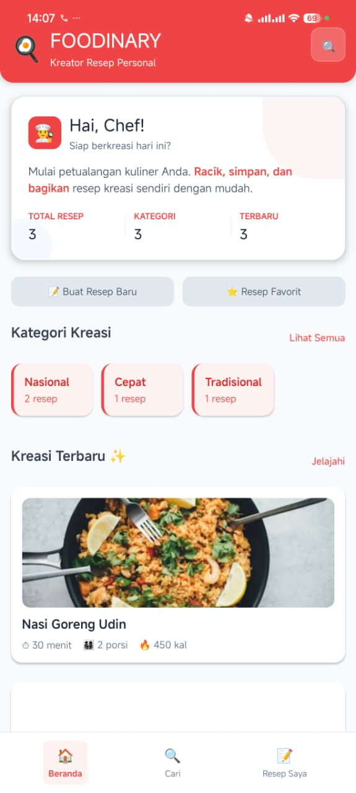
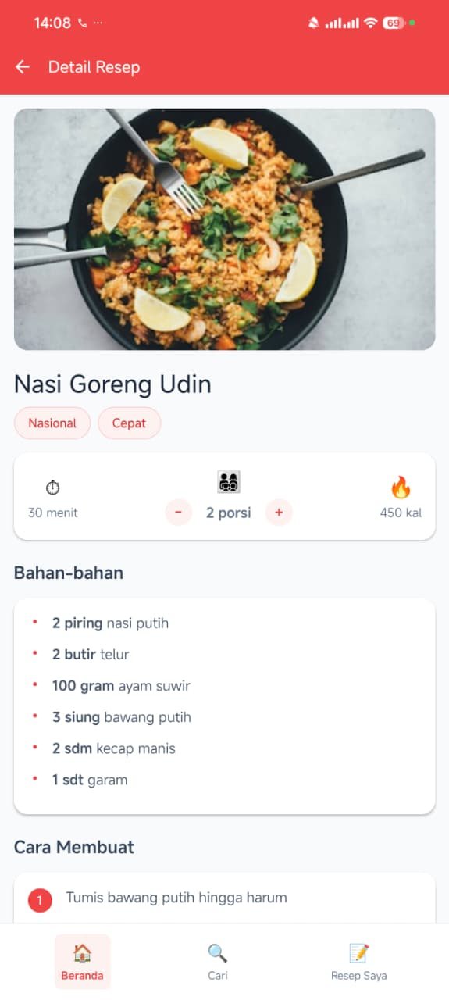

# 🍳 FOODINARY - Aplikasi Kreasi Resep Personal

<div align="center">


Aplikasi mobile untuk membuat, menyimpan, dan mengelola resep masakan kreasi sendiri.

</div>

## 📸 Screenshots

| Home Screen | Kelola Resep | Detail Resep |
|-------------|--------------|--------------|
|  |  |  |

## ✨ Fitur

- 🎨 **Buat Resep Kreasi** - Form lengkap untuk resep custom
- 📁 **Kelola Resep** - Edit, hapus, dan organisasi resep
- 🔍 **Pencarian Cerdas** - Cari berdasarkan nama, bahan, atau kategori
- 🏷️ **Kategori** - Organisasi resep oleh kategori
- 💾 **Penyimpanan Lokal** - Data tersimpan secara lokal di device
- 📱 **Responsive** - Tampilan optimal di mobile dan web

## 🚀 Instalasi & Menjalankan

### Prerequisites
- Node.js (versi 14 atau lebih baru)
- npm atau yarn
- Expo CLI

### Setup Project
```bash
# Clone repository
git clone https://github.com/username/foodinary.git
cd foodinary

# Install dependencies
npm install

# Jalankan aplikasi
npx expo start
